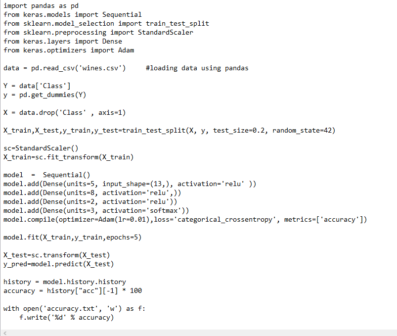

## Task 3
**Introduction**
*In the given task we have to integrate Machine Learning model with Jenkins. 
The only task which developer has to do **push** his code to GitHub which trigger **Jenkins**.
The code is then downloaded by **jenkins** in its workspace and it copies the code in the Host OS ie, RHEL8 in my case (**Job 1**).
The code is then analysed by jenkins using shell scripting i.e, the code is either of deep learning or machine learning and it automatically launch a container according to its condition.(**Job 2**)
In the next step the code is run inside the container and give ouput as text file which contain the accuracy of model(**Job 3**).
Using bash scripting we checked if the accuracy is greater than threshold which is **90** in my case it gives output Accuracy is good If not it will trigger another jenkins Job.(**Job 4**)
If the accuracy is found less than threshold this job will increase the epochs by **5** and trigger **Job 3** and the Process from **Job 3** to **Job 5** run again and again untill we get the desired accuracy (**Job 5**).
Thus we created a pipeline of  5 Jobs  to complete this task*

# Code:

# Docker file used :

*If you build a docker file it gives you image "**docker build -t image-name:tag /directory** (you can use "." if you build from same same folder as it means present directory.)*

# Job 1 description :

*This is done to download code from GitHub*

 *To copy code in Host OS which is then mount to container using **volume**.*
 
 # Console output of Job 1 :
 
 
 # Job 2 Description :
 
  
 *This is now become a **downstream job** only build if **Job 1**(Upstream job) is build stable.*
 
 
 
 *We used nested **If-Else** here if the container is already build it start the container or if you run the code for the first time if build the container with required image.*
 
 
 
 *In my case the container is already build as i have testes the code many times so it start the container in my case*
 
 # Job 3 description :
 
 
 *As Job 3 is a **downstream job** of **Job 2** it run if the container build sucessfully*
 
 
  
 *We used exec bash command to run the code inside the docker without using it interactive terminal*
 
 

*As you can see the code is run successfully with 5 epochs*

# Job 4 descrpition: 

*This job is a *downstream job* of Job 3*

*This is condition we used to compare the accuracy of model **($accuracy)** with the threshold accuracy **($b)**.
(-gt) is used to check the condition **"Greater than"** in Linux bash script*

*As the accuracy comes out lesser than threshold it then trigger the **Job 5** (which will increase its epocs).*

# Job 5 desription :

*SED command in UNIX is stands for stream editor and it can perform lot’s of function on file like, searching, find and replace, insertion or deletion. Though most common use of SED command in UNIX is for substitution or for find and replace. By using SED you can edit files even without opening it, which is much quicker way to find and replace something in file, than first opening that file in VI Editor and then changing it.*

**Syntax :**
**sed OPTIONS... [SCRIPT] [INPUTFILE...]**

*After changing the number of epochs it again build the model i.e, build **Job 3** and then after the completion of Job 3 it again check the accuracy via Job 4.*

# Result of Job 5:
**Job 3**

**Job 4**

